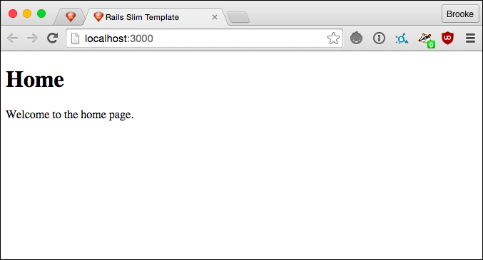

# Rails Slim Template

Bootstraps a Ruby on Rails project with the minimum essentials to get started which is less than
what is provided with the `rails new <app name>` defaults. This template is best applied when
creating a new Ruby on Rails application.

<!-- Tocer[start]: Auto-generated, don't remove. -->

## Table of Contents

  - [Features](#features)
  - [Requirements](#requirements)
  - [Usage](#usage)
  - [Setup](#setup)
  - [Versioning](#versioning)
  - [Code of Conduct](#code-of-conduct)
  - [Contributions](#contributions)
  - [License](#license)
  - [History](#history)
  - [Credits](#credits)

<!-- Tocer[finish]: Auto-generated, don't remove. -->

## Features

The following highlights what is applied with this template:

- Uses [Ruby 2.4.x](http://www.ruby-lang.org).
- Uses [Ruby on Rails 5.x.x](http://rubyonrails.org).
- Adds the [PG](https://bitbucket.org/ged/ruby-pg/wiki/Home) gem requirement.
- Adds the [Puma](http://puma.io) gem requirement.
- Adds the [Ruby on Rails](http://rubyonrails.org) gem requirement.
- Adds the [Rake](https://github.com/jimweirich/rake) gem requirement.
- Adds the [Slim Rails](https://github.com/slim-template/slim) gem requirement.
- Adds the [Webpacker](https://github.com/rails/webpacker) gem requirement.
- Adds the [Awesome Print](https://github.com/michaeldv/awesome_print) gem requirement.
- Adds the [Bond](https://github.com/cldwalker/bond) gem requirement.
- Adds the [Bootsnap](https://github.com/Shopify/bootsnap) gem requirement.
- Adds the [Bundler Audit](https://github.com/rubysec/bundler-audit) gem requirement.
- Adds the [Git Cop](https://github.com/bkuhlmann/git-cop) gem requirement.
- Adds the [Hirb](https://github.com/cldwalker/hirb) gem requirement.
- Adds the [Pry](https://github.com/pry/pry) gem requirement.
- Adds the [Pry ByeBug](https://github.com/deivid-rodriguez/pry-byebug) gem requirement.
- Adds the [Reek](https://github.com/troessner/reek) gem requirement.
- Adds the [RSpec Rails](https://github.com/dchelimsky/rspec-rails) gem requirement.
- Adds the [Rubocop](https://github.com/bbatsov/rubocop) gem requirement.
- Adds the [Wirb](https://github.com/janlelis/wirb) gem requirement.
- Adds the [Listen](https://github.com/guard/listen) gem requirement.
- Adds the [Milestoner](https://github.com/bkuhlmann/milestoner) gem requirement.
- Adds the [Pragmater](https://github.com/bkuhlmann/pragmater) gem requirement.
- Adds the [Tocer](https://github.com/bkuhlmann/tocer) gem requirement.
- Adds the [Capybara](https://github.com/jnicklas/capybara) gem requirement.
- Adds the [Climate Control](https://github.com/thoughtbot/climate_control) gem requirement.
- Adds the [Code Climate Test Reporter](https://github.com/codeclimate/ruby-test-reporter) gem requirement.
- Adds the [Factory Bot Rails](https://github.com/thoughtbot/factory_bot_rails) gem requirement.
- Adds the [Launchy](https://github.com/copiousfreetime/launchy) gem requirement.
- Adds the [VCR](https://github.com/vcr/vcr) gem requirement.
- Installs a customized application.html.erb file with a basic site layout.
- Installs customized application graphics.
- Installs customized generator defaults.
- Installs a `.gitignore` file with general [Git](http://git-scm.com) exclusions.
- Installs a `.ruby-version` file for multiple Ruby VM support.

## Requirements

0. A UNIX-based system.
0. [Ruby 2.5.x](http://www.ruby-lang.org).
0. [Ruby on Rails 5.x.x](http://rubyonrails.org).
0. A solid internet connection.

## Usage

Open a terminal window and execute one the following command lines depending on your version
preference:

Current Version (stable):

    rails new demo --skip-git --skip-gemfile --skip-bundle --skip-test --skip-spring --skip-turbolinks --skip-puma --skip-keeps --force --database postgresql --template https://raw.github.com/bkuhlmann/rails_slim_template/v7.0.0/template.rb

Master Version (unstable):

    rails new demo --skip-git --skip-gemfile --skip-bundle --skip-test --skip-spring --skip-turbolinks --skip-puma --skip-keeps --force --database postgresql --template https://raw.github.com/bkuhlmann/rails_slim_template/master/template.rb

*TIP*: You can reduce unnecessary typing with new app generation by adding the new rails options,
listed above, to your `.railsrc` file. Any options in the .railsrc file will be applied with each
new app generation.

## Setup

After the template has been applied, you'll want to tweak the following files:

- public/apple-touch-icon-114x114.png = Replace with your own custom image.
- public/apple-touch-icon.png = Replace with your own custom image.
- public/favicon.ico = Replace with your own custom icon.

## Versioning

Read [Semantic Versioning](http://semver.org) for details. Briefly, it means:

- Major (X.y.z) - Incremented for any backwards incompatible public API changes.
- Minor (x.Y.z) - Incremented for new, backwards compatible, public API enhancements/fixes.
- Patch (x.y.Z) - Incremented for small, backwards compatible, bug fixes.

## Code of Conduct

Please note that this project is released with a [CODE OF CONDUCT](CODE_OF_CONDUCT.md). By
participating in this project you agree to abide by its terms.

## Contributions

Read [CONTRIBUTING](CONTRIBUTING.md) for details.

## License

Copyright (c) 2013 [Alchemists](https://www.alchemists.io).
Read [LICENSE](LICENSE.md) for details.

## History

Read [CHANGES](CHANGES.md) for details.

## Credits

Developed by [Brooke Kuhlmann](https://www.alchemists.io) at
[Alchemists](https://www.alchemists.io).
