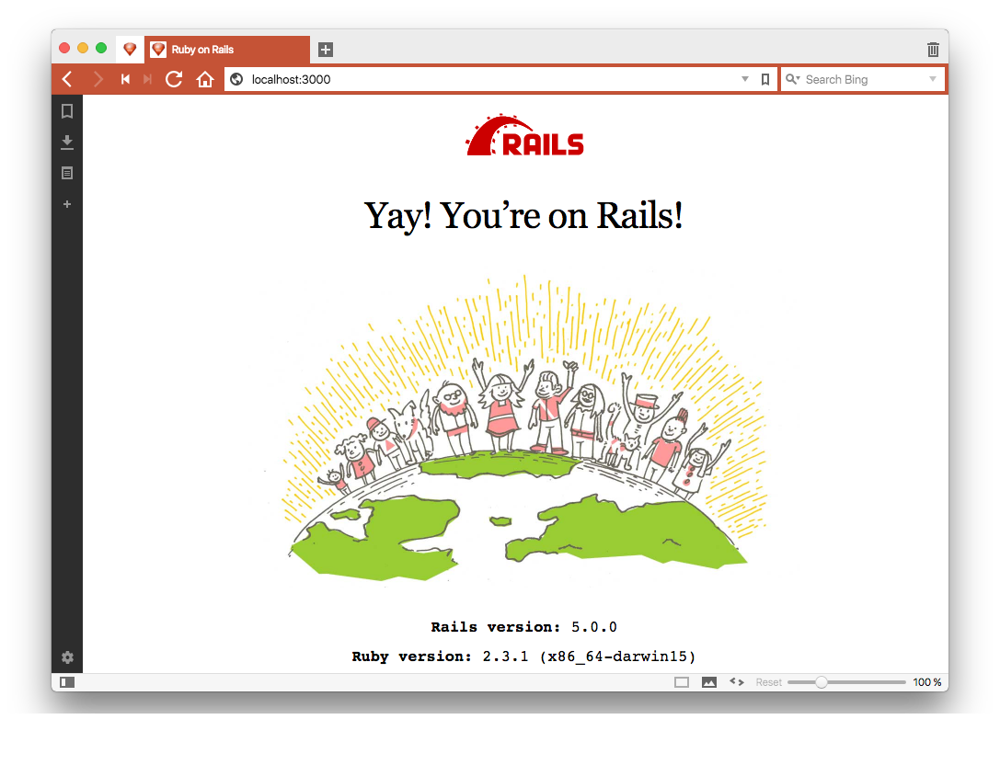

# Rails Slim Template

Bootstraps a Ruby on Rails project with the minimum essentials to get started which is less than what is provided with
the `rails new <app name>` defaults. This template is best applied when creating a new Ruby on Rails application.

<!-- START doctoc generated TOC please keep comment here to allow auto update -->
<!-- DON'T EDIT THIS SECTION, INSTEAD RE-RUN doctoc TO UPDATE -->
# Table of Contents

- [Features](#features)
- [Requirements](#requirements)
- [Usage](#usage)
- [Setup](#setup)
- [Versioning](#versioning)
- [Code of Conduct](#code-of-conduct)
- [Contributions](#contributions)
- [License](#license)
- [History](#history)
- [Credits](#credits)

<!-- END doctoc generated TOC please keep comment here to allow auto update -->

# Features

The following highlights what is applied with this template:

- Uses [Ruby 2.2.x](http://www.ruby-lang.org).
- Uses [Ruby on Rails 4.2.x](http://rubyonrails.org).
- Adds the [SQLite3](https://www.sqlite.org) gem requirement.
- Adds the [Puma](http://puma.io) gem requirement.
- Adds the [Rake](https://github.com/jimweirich/rake) gem requirement.
- Adds the [Ruby on Rails](http://rubyonrails.org) gem requirement.
- Adds the [Uglifier](https://github.com/lautis/uglifier) gem requirement.
- Adds the [Slim Rails](https://github.com/slim-template/slim) gem requirement.
- Adds the [SASS Rails](https://github.com/rails/sass-rails) gem requirement.
- Adds the [jQuery Rails](https://github.com/rails/jquery-rails) gem requirement.
- Adds the [Dotenv Rails](https://github.com/bkeepers/dotenv) gem requirement.
- Adds the [Pry](https://github.com/pry/pry) gem requirement.
- Adds the [Pry ByeBug](https://github.com/deivid-rodriguez/pry-byebug) gem requirement.
- Adds the [Pry Remote](https://github.com/Mon-Ouie/pry-remote) gem requirement.
- Adds the [Pry State](https://github.com/SudhagarS/pry-state) gem requirement.
- Adds the [Pry Rescue](https://github.com/ConradIrwin/pry-rescue) gem requirement.
- Adds the [Pry Stack Explorer](https://github.com/pry/pry-stack_explorer) gem requirement.
- Adds the [Bond](https://github.com/cldwalker/bond) gem requirement.
- Adds the [Wirb](https://github.com/janlelis/wirb) gem requirement.
- Adds the [Hirb](https://github.com/cldwalker/hirb) gem requirement.
- Adds the [Awesome Print](https://github.com/michaeldv/awesome_print) gem requirement.
- Adds the [Priscilla](https://github.com/Arkham/priscilla) gem requirement.
- Adds the [RSpec Rails](https://github.com/dchelimsky/rspec-rails) gem requirement.
- Adds the [Jasmine](http://jasmine.github.io) gem requirement.
- Adds the [Jasmine jQuery Rails](https://github.com/travisjeffery/jasmine-jquery-rails) gem requirement.
- Adds the [Rubocop](https://github.com/bbatsov/rubocop) gem requirement.
- Adds the [Rails Best Practices](http://rails-bestpractices.com) gem requirement.
- Adds the [SCSS Lint](https://github.com/brigade/scss-lint) gem requirement.
- Adds the [Milestoner](https://github.com/bkuhlmann/milestoner) gem requirement.
- Adds the [Database Cleaner](https://github.com/bmabey/database_cleaner) gem requirement.
- Adds the [Factory Girl Rails](https://github.com/thoughtbot/factory_girl_rails) gem requirement.
- Adds the [Climate Control](https://github.com/thoughtbot/climate_control) gem requirement.
- Adds the [VCR](https://github.com/vcr/vcr) gem requirement.
- Adds the [Capybara](https://github.com/jnicklas/capybara) gem requirement.
- Adds the [Launchy](https://github.com/copiousfreetime/launchy) gem requirement.
- Adds the [Poltergeist](https://github.com/teampoltergeist/poltergeist) gem requirement.
- Adds the [Code Climate](https://github.com/codeclimate/ruby-test-reporter) gem requirement.
- Installs a customized application.html.erb file with a basic site layout.
- Installs customized application graphics.
- Installs customized generator defaults.
- Installs a simple _home_ controller for demo usage.
- Installs a .gitignore file with general [Git](http://git-scm.com) exclusions.
- Installs a .rbenv-version file for use with [rbenv](https://github.com/sstephenson/rbenv).

# Requirements

0. A UNIX-based system.
0. [Ruby 2.x.x](http://www.ruby-lang.org).
0. [Ruby on Rails 4.2.x](http://rubyonrails.org).
0. A solid internet connection.

# Usage

Open a terminal window and execute one the following command lines depending on your version preference:

Current Version (stable):

    rails new demo -d sqlite3 -T -f --skip-bundle -m https://raw.github.com/bkuhlmann/rails_slim_template/v4.0.0/template.rb

Master Version (unstable):

    rails new demo -d sqlite3 -T -f --skip-bundle -m https://raw.github.com/bkuhlmann/rails_slim_template/master/template.rb

Here is what each option is doing and why:

    -d: Specifies the SQLite3 database for quick and easy setup.
    -T: Skips setting up Test::Unit files since RSpec is what we want.
    -f: Forces overwrite of any existing files so the template is not interrupted during setup.
    --skip-bundle: Skips running "bundle install" since the template does this for you at appropriate time of setup.
    -m: The template file to execute.

*TIP*: You can reduce unnecessary typing with new app generation by adding the new rails options, listed above,
to your .railsrc file. Any options in the .railsrc file will be applied with each new app generation.

# Setup

After the template has been applied, you'll want to tweak the following files:

- public/apple-touch-icon-114x114.png = Replace with your own custom image.
- public/apple-touch-icon.png = Replace with your own custom image.
- public/favicon.ico = Replace with your own custom icon.

# Versioning

Read [Semantic Versioning](http://semver.org) for details. Briefly, it means:

- Patch (x.y.Z) - Incremented for small, backwards compatible bug fixes.
- Minor (x.Y.z) - Incremented for new, backwards compatible public API enhancements and/or bug fixes.
- Major (X.y.z) - Incremented for any backwards incompatible public API changes.

# Code of Conduct

Please note that this project is released with a [CODE OF CONDUCT](CODE_OF_CONDUCT.md). By participating in this project
you agree to abide by its terms.

# Contributions

Read [CONTRIBUTING](CONTRIBUTING.md) for details.

# License

Copyright (c) 2013 [Alchemists](https://www.alchemists.io).
Read the [LICENSE](LICENSE.md) for details.

# History

Read the [CHANGELOG](CHANGELOG.md) for details.
Built with [Gemsmith](https://github.com/bkuhlmann/gemsmith).

# Credits

Developed by [Brooke Kuhlmann](https://www.alchemists.io) at [Alchemists](https://www.alchemists.io)
